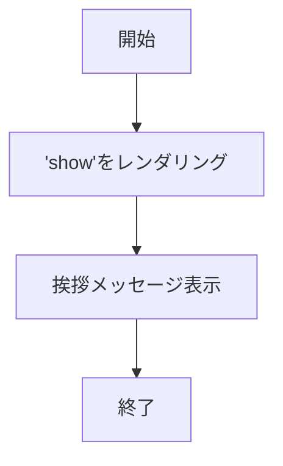
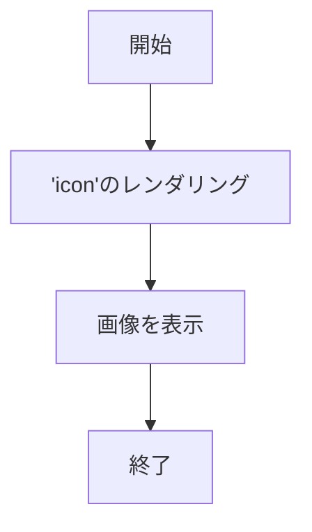
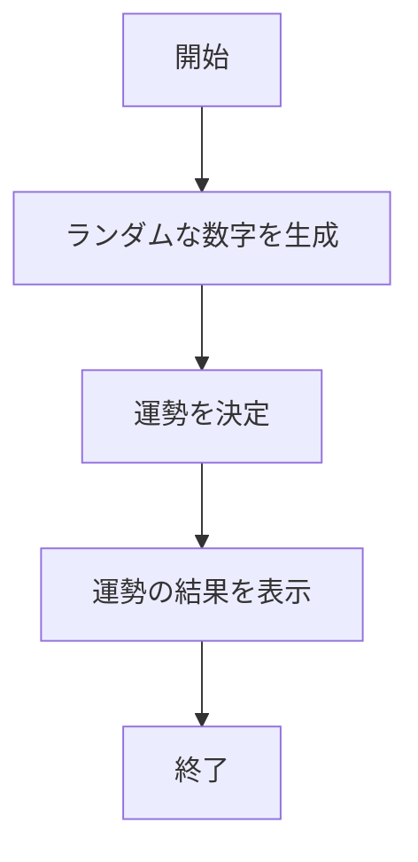
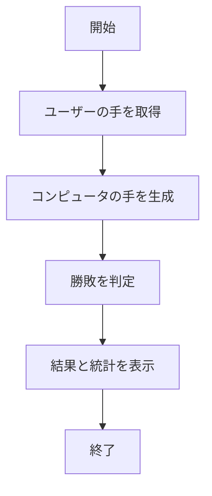
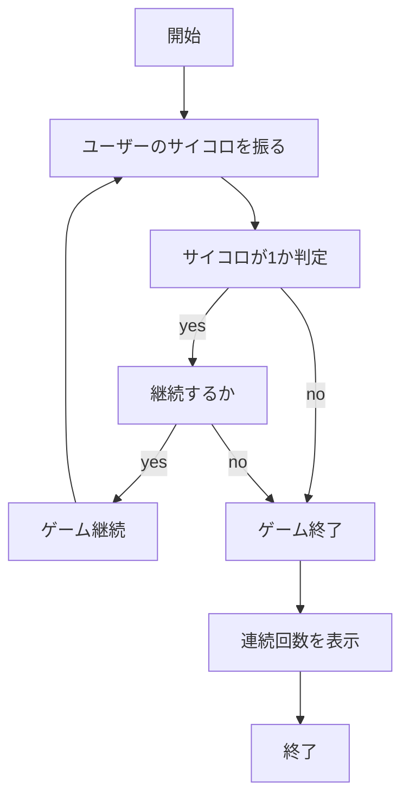
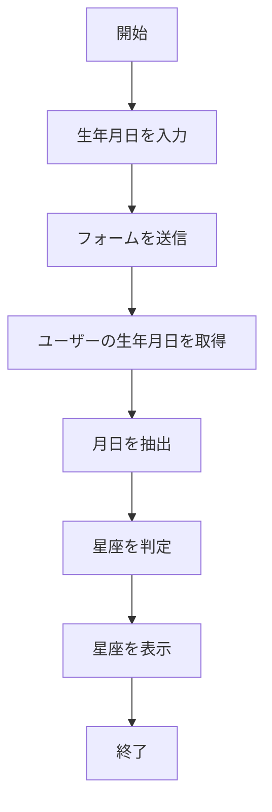
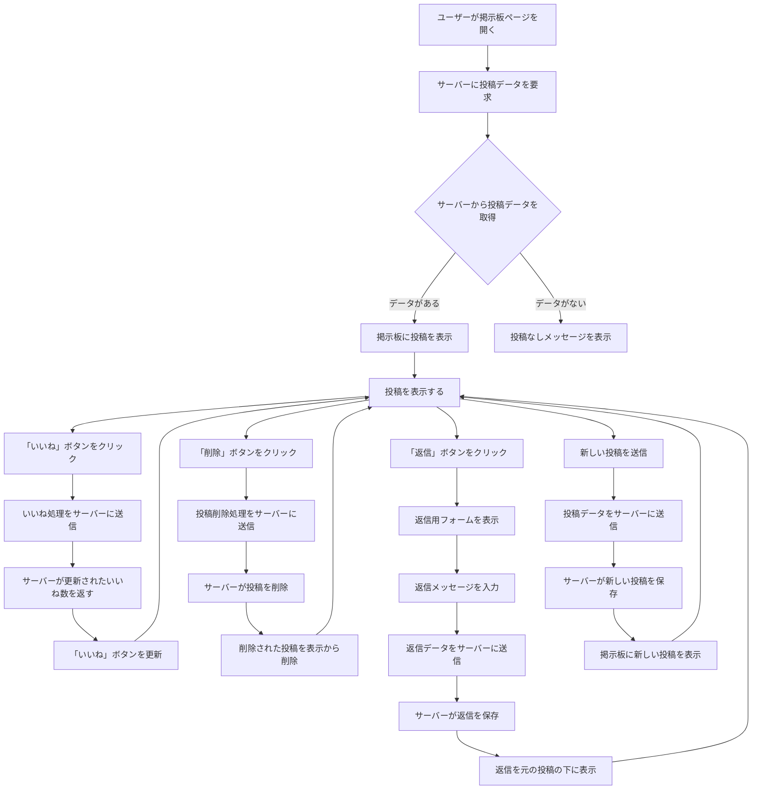

# webpro_06

## このプログラムについて

## ファイル一覧
ファイル名 | 説明
-|-
app5.js | プログラム本体
show.ejs | あいさつ表示のテンプレートファイル
icon.ejs | 画像表示のテンプレートファイル
luck.ejs | 運勢占いのテンプレートファイル
public/janken.html | じゃんけんの開始画面
views/janken.ejs | じゃんけんのテンプレートファイル
views/dice.ejs | サイコロチャレンジのテンプレートファイル
views/zodiac-form.ejs | 星座判定のテンプレートファイル


##　編集したファイルをGitで管理する方法
1. cdコマンドで編集したファイルのあるディレクトリに移動する
1. ターミナルで```git add .```と入力する
1. ターミナルで```git commit -am 'コメント'```と入力する
1. コメントの部分には変更内容や変更理由を記入する
1. ターミナルで```git push```と入力する
1. git上のファイルが更新されている

##　使用方法

### hello１機能
#### 機能説明
「Hello world」と「Bon jour」という文字が表示される．
####　使用手順
1. ```app5.js``` を起動する
1. Webブラウザで```localhost:8080/hello１```にアクセスする
1. 画像が表示される
####　フローチャート


### hello2機能
#### 機能説明
「Hello world」と「Bon jour」という文字が表示される．
####　使用手順
1. ```app5.js``` を起動する
1. Webブラウザで```localhost:8080/hello2```にアクセスする
1. 画像が表示される
####　フローチャート


### アイコン表示
#### 機能説明
Appleの画像が表示される．
####　使用手順
1. ```app5.js``` を起動する
1. Webブラウザで```localhost:8080/icon```にアクセスする
1. 画像が表示される
####　フローチャート



### 運勢占い
#### 機能説明
ランダムに生成された1〜6の数字を使用し,ユーザーに大吉,中吉,吉の運勢を決定する．運勢の結果と数字を表示する．
####　使用手順
1. ```app5.js``` を起動する
1. Webブラウザで```localhost:8080/luck```にアクセスする
1. 運勢が表示される
####　フローチャート




### じゃんけん
#### 機能説明
ユーザーが送信したグー,チョキ,パーに対して,コンピュータとじゃんけんを行う.ゲーム結果の勝ち,負け,引き分けを判定し,勝利回数やトータル回数を表示する．
####　使用手順
1. ```app5.js``` を起動する
1. Webブラウザで```localhost:8080/public/janken.html```にアクセスする
1. 自分の手を入力する
####　フローチャート



### ピンゾロチャレンジゲーム
#### 機能説明
最初にサイコロの目が1と表示され,ユーザーがサイコロを振ることで,その目が1かそれ以外かを判定する.もし1が出た場合,ゲームは継続し,1以外の目が出た場合は終了となる．継続した場合ユーザーは続けるか辞めるかを選択することができる．
####　使用手順
1. ```app5.js``` を起動する
1. Webブラウザで```localhost:8080/dice```にアクセスする
1. サイコロを振る
1. ゾロ目が出たら続けるか辞めるかを選べる
####　フローチャート



### 星座判定
#### 機能説明
ユーザーが生年月日を入力できるフォームが表示され，ユーザーが生年月日を入力し、送信すると、生年月日に基づいて星座を判定し、その星座を返す．
####　使用手順
1. ```app5.js``` を起動する
1. Webブラウザで```localhost:8080/zodiac-form```にアクセスする
1. 自分の生年月日を入力する
####　フローチャート




2024/11/18
